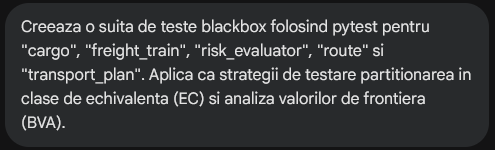
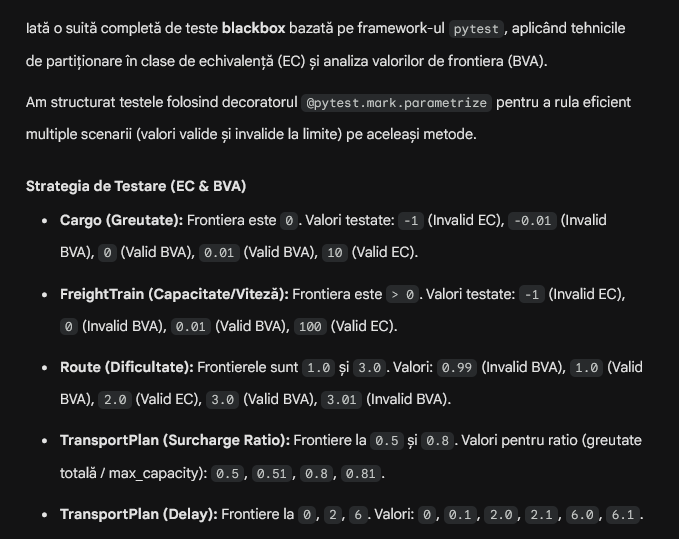
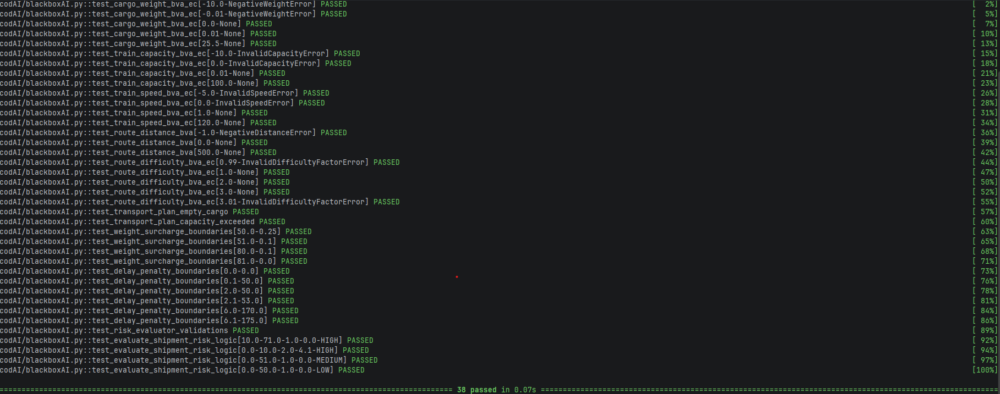
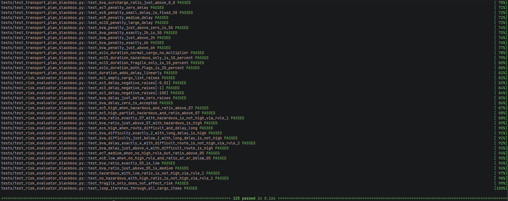
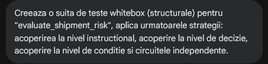
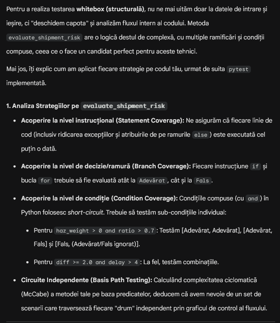
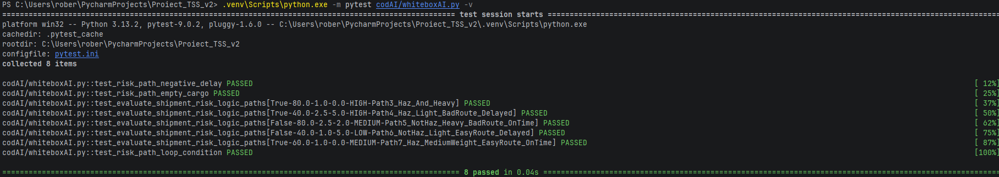
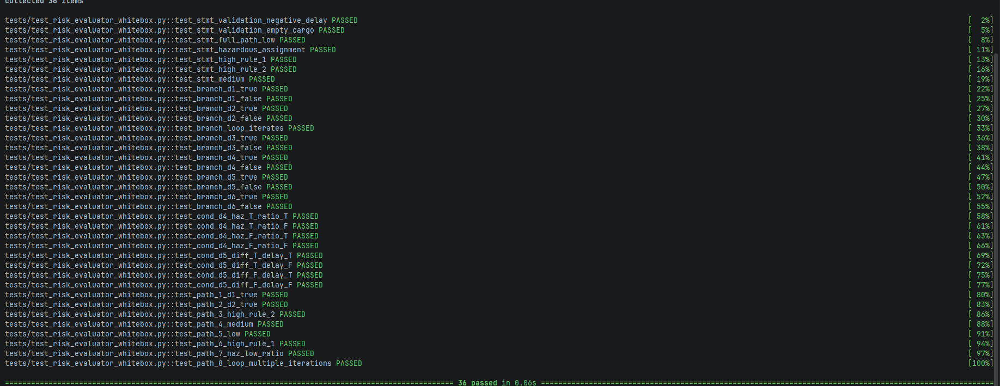

# Raport AI — Aplicație Transport Feroviar

**Proiect realizat de:** Marcu-George Robert, Brișiț Mario-Vlad
**Grupa:** 311

---

## Overview

În acest raport vom ilustra rezultate în urma folosirii AI-ului în cadrul proiectului nostru pentru generarea suitelor de teste blackbox și whitebox.

Pentru context s-au oferit fișierele `cargo.py`, `freight_train.py`, `route.py`, `transport_plan.py`, `risk_evaluator.py` și `transport_service.py` din `domain/`, respectiv `service/`.

Pentru procesarea contextului cât și pentru generarea suitei de teste s-a folosit **Gemini 3.1 Pro** rulat din interfața web.

Urmează să ilustrăm diferențele (acolo unde există) în abordare și rezultate dintre testele noastre și cele generate cu Gemini.

Codul generat de către Gemini poate fi găsit în folderul [`codAI/`](codAI/).

---

## Testarea Blackbox

### Prompt

### Răspuns

Codul generat este disponibil în [`codAI/blackboxAI.py`](codAI/blackboxAI.py).

### Observații

Observăm că Gemini a respectat cerințele pentru aplicarea strategiilor din prompt. Acesta a generat un singur fișier `.py` ce include toate testele cerute. Aplicarea strategiilor este corectă.

### Rezultate cod AI rulat

### Rezultate cod propriu

### Comparație și concluzie

În urma rulării codului generat de Gemini observăm că acesta atinge toate punctele cerute și standardele relevante de testare.

---

## Testarea Whitebox

### Prompt

### Răspuns

Codul generat este disponibil în [`codAI/whiteboxAI.py`](codAI/whiteboxAI.py).

### Observații

Observăm că Gemini a respectat cerința dar sub o formă compactată. Acesta a generat cod ce încearcă să atingă toate punctele cerinței într-un mod cât mai eficient, alegând să testeze mai multe acoperiri în cadrul unui singur test în comparație cu testele noastre ce verifică fiecare aspect unul câte unul. Observăm și explicațiile aduse sub formă de comentarii explicite incluse de către Gemini în ciuda lipsei unei astfel de cerințe în prompt.

### Rezultate cod AI rulat

### Rezultate cod propriu

### Comparație și concluzie

Observăm o diferență clară în metoda de abordare. Deși codul generat de Gemini este inclusiv, acesta optează pentru soluții mai compacte în scopul salvării de token-uri și spațiu în context. Capabilitatea uneltelor AI nu se poate pune la îndoială, însă tendința acestora spre compactare și eficientizare, deși nu problematică de la sine, poate introduce probleme ulterioare rezultate dintr-o posibilă lipsă de rigurozitate. Astfel, sfătuim utilizatorii agenților AI să fie cât mai expliciți în prompturi și să verifice rigurozitatea agenților folosiți.
